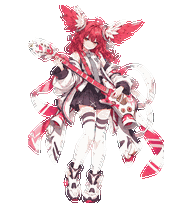
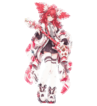
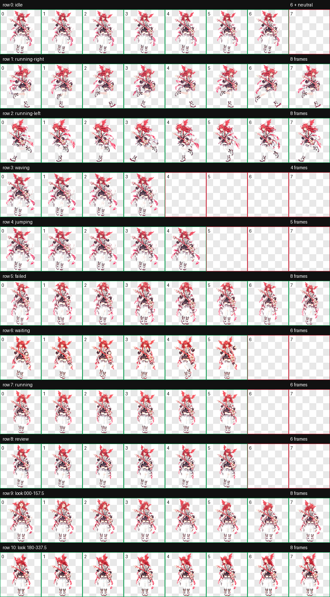

# Animations and triggers

These triggers reflect the desktop app behavior inspected for this release. The host app controls state selection; when several tasks are present, notification priority can affect the animation shown. Behavior may vary between app versions.

| State | Trigger | Lian Tu's animation |
| --- | --- | --- |
| `idle` | No task needs attention | Gentle breathing and blinking |
| `running-right` | Dragging the pet to the right | Running right |
| `running-left` | Dragging the pet to the left | Running left |
| `waving` | The initial welcome greeting | A friendly wave |
| `jumping` | Pointer hover interaction | A gentle wave with both feet planted |
| `failed` | A failed or blocked task | A downcast reaction |
| `waiting` | Approval or additional information is needed | Waiting and inviting a response |
| `running` | A task is in progress | Playing guitar while standing |
| `review` | A completed task has unread results | Inspecting the guitar attentively |

The `running` state represents ongoing work. Directional running uses the separate `running-left` and `running-right` states.

## Gentle interaction

The jump slot retains the five-frame layout expected by the host, using the completed waving frames in the order `0 → 1 → 2 → 3 → 0`. This revision changes only row 4, counting from zero. Pixels in the other ten rows remain identical.

## Sixteen gaze directions

When the app provides a gaze target, such as a computer-use cursor or text input position, Lian Tu uses the corresponding head-turn frame. The four cardinal directions are 000° up, 090° right, 180° down, and 270° left, measured in screen coordinates.

## More previews

| Greeting | Blocked task |
| :---: | :---: |
|  |  |

View the complete animation sheet

